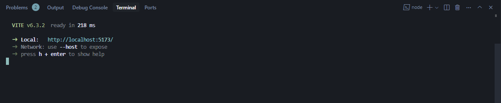
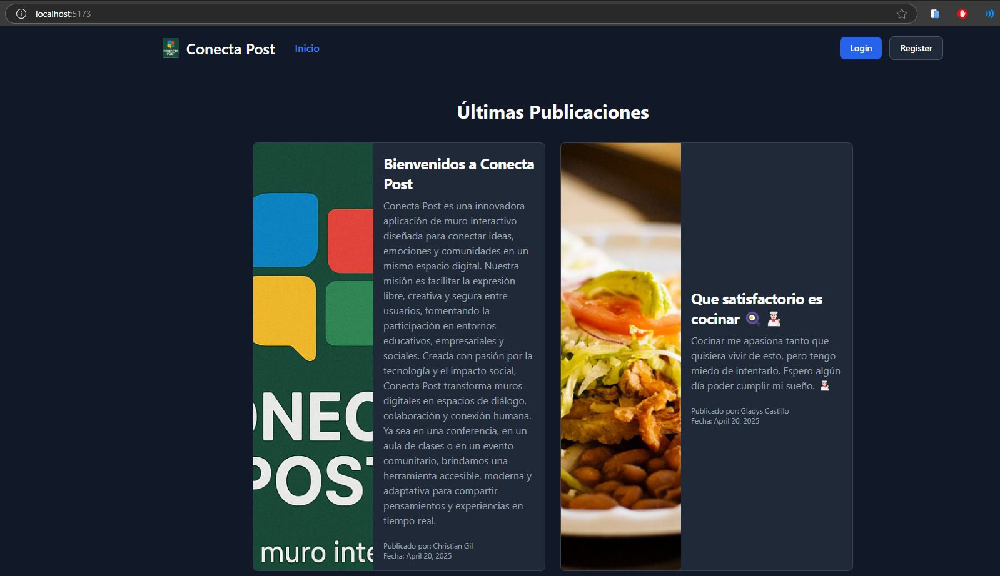
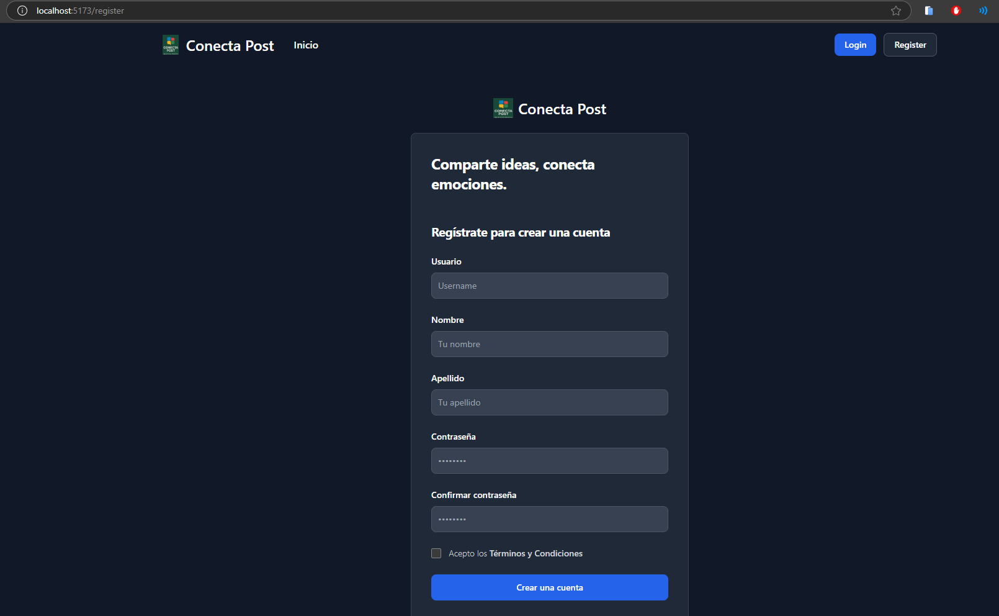
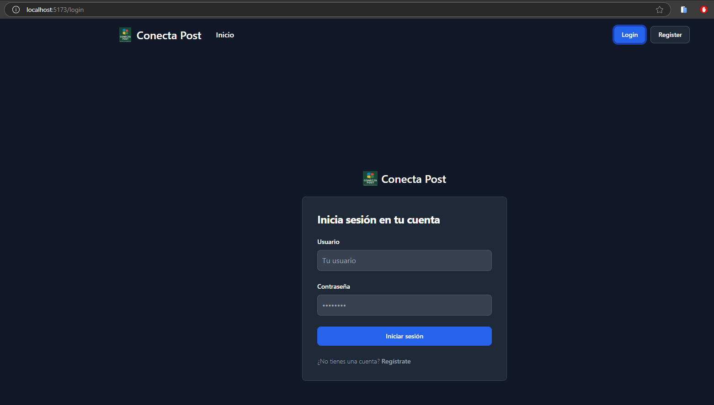
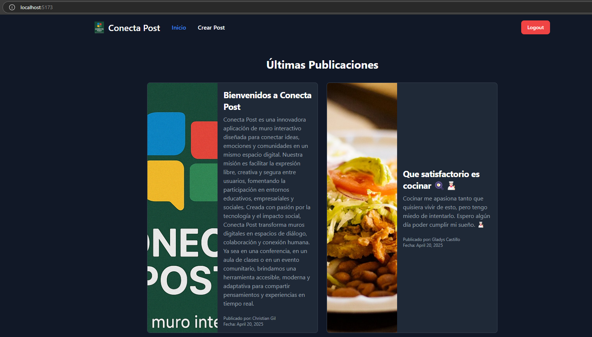
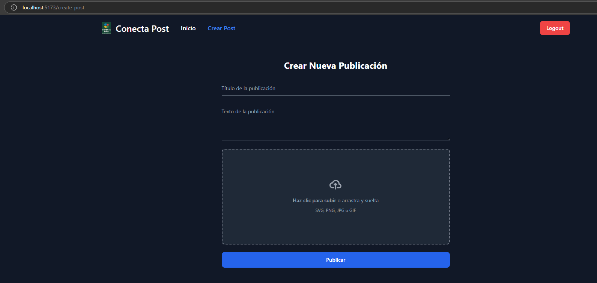
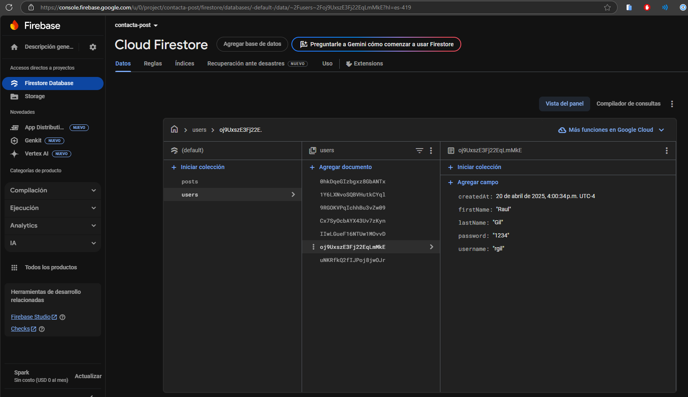
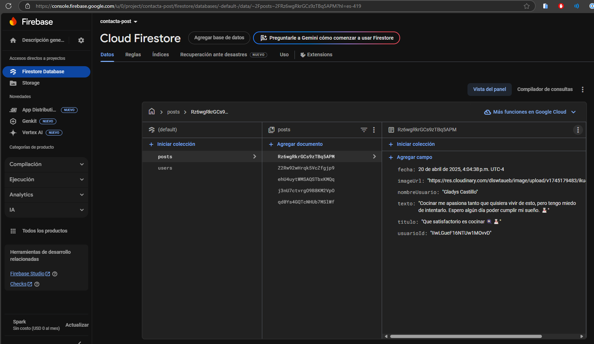
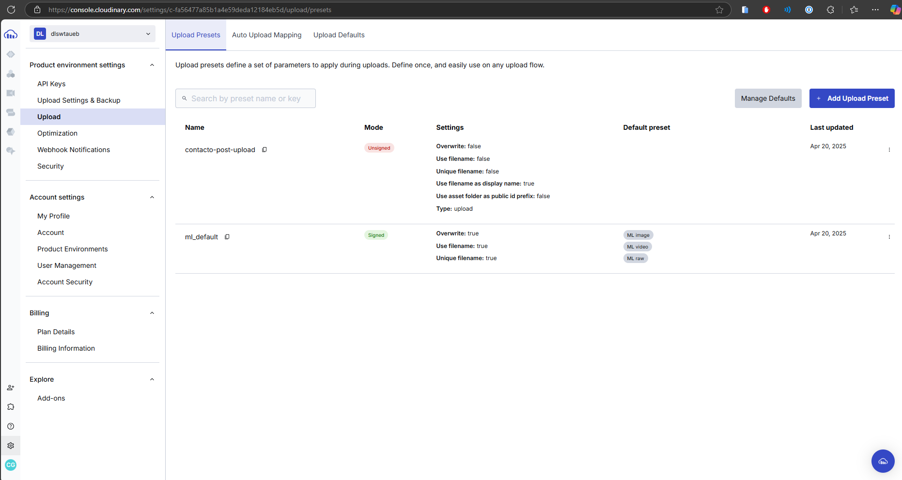

# 🚀 ConectaPosts

¡Hola! Soy **Christian Gil** 👋

📌 **Matrícula:** 2012-1036  
📚 **Materia:** Programación Web  
👨‍🏫 **Profesor:** Raydelto Hernández Perera  
🏫 **Institución:** ITLA  

## 📲 Descripción

Esta es una aplicación web moderna construida con React y Vite para conectar a través de publicaciones. Permite a los usuarios interactuar, crear y visualizar posts, utilizando Firebase para la autenticación y almacenamiento de datos en tiempo real.

La aplicación cuenta con una interfaz de usuario responsive y funcional, desarrollada con Tailwind CSS y Flowbite.

✨ Características:

- ✅ **Gestión de Posts:** Crear y visualizar las publicaciones.
- ✅ **Autenticación de Usuarios:** Inicio de sesión y registro mediante Firebase.
- ✅ **Actualizaciones en Tiempo Real:** Actualizaciones de posts en tiempo real usando Cloudinary.
- ✅ **Diseño Responsive:** Interfaz adaptable a distintos dispositivos construida con Tailwind CSS y Flowbite.
- ✅ **Enrutamiento del Lado del Cliente:** Navegación fluida implementada con React Router.

Es el proyecto final de la materia de Programación Web impartida por el profesor **Raydelto Hernández**.

---

## 🎬 Guía en Video

Puedes ver una demostración del funcionamiento de la aplicación en el siguiente video:

[](https://youtu.be/FwVJqLNeFpo)

---

## 📸 Capturas de Pantalla

A continuación, se muestran capturas de pantalla del proyecto:

1.  
2.  
3.  
4.  
5.  
6.  
7.  
8.  
9.  
10. 

---

## 🚀 Instrucciones de Uso

Sigue estos pasos para obtener una copia local y ponerla en funcionamiento.

### Pre-requisitos

*   Node.js (v18 o superior recomendado)
*   pnpm (o npm/yarn)

```bash
npm install -g pnpm
```

### Instalación

1.  🛠️ Clona este repositorio:

    ```bash
    git clone https://github.com/chrisfelixgil/contacta-post.git
    cd conectaposts
    ```

2.  Instala las dependencias:

    ```bash
    pnpm install
    ```

3.  Configura Firebase:
    *   Crea un proyecto en Firebase en [https://console.firebase.google.com/](https://console.firebase.google.com/).
    *   Obtén las credenciales de configuración de tu proyecto Firebase.
    *   Crea un archivo `.env.local` en la raíz del proyecto y añade tu configuración:
        ```env
        VITE_FIREBASE_API_KEY=TU_API_KEY
        VITE_FIREBASE_AUTH_DOMAIN=TU_AUTH_DOMAIN
        VITE_FIREBASE_PROJECT_ID=TU_PROJECT_ID
        VITE_FIREBASE_STORAGE_BUCKET=TU_STORAGE_BUCKET
        VITE_FIREBASE_MESSAGING_SENDER_ID=TU_MESSAGING_SENDER_ID
        VITE_FIREBASE_APP_ID=TU_APP_ID
        ```
        *(Nota: Ajusta los nombres de las variables según cómo se consuman en `src/firebase/config.js` o similar)*

### Ejecutar el Servidor de Desarrollo

```bash
pnpm dev
```

4.  Abre tu navegador en:

    ```
    http://localhost:5173
    ```

---

## 🧱 Estructura del Proyecto 

```
conectaposts/
├── public/
├── src/
│   ├── assets/
│   ├── components/
│   ├── context/
│   ├── img/
│   ├── pages/
│   ├── App.css
│   ├── App.jsx
│   ├── firebaseConfig.js
│   ├── index.css
│   └── main.jsx
├── .env.local
├── .eslintrc.js
├── .gitignore
├── index.html
├── package.json
├── pnpm-lock.yaml
├── postcss.config.js
├── tailwind.config.js
├── vite.config.js
└── README.md
```

---

# 🚀 Tecnologías Utilizadas

*   **Framework:** React 19
*   **Bundler/Tooling:** Vite
*   **Enrutamiento:** React Router
*   **Estilos:** Tailwind CSS, Flowbite
*   **Cliente HTTP:** Axios
*   **Backend/Base de Datos:** Firebase
*   **Servidor de imagenes:** Cloudinary
*   **Linting:** ESLint
*   **Gestor de Paquetes:** pnpm

---

## 🙏 Créditos

Esta tarea fue desarrollada como parte de la materia de Programación Web impartida por el profesor **Raydelto Hernández** para el Instituto Tecnológico de Las Américas (ITLA).

---

## 📄 Licencia

Este proyecto se distribuye bajo la licencia MIT. Consulta el archivo [LICENSE](LICENSE) para más detalles.


